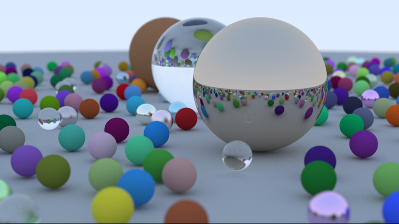

# Python implementation of Ray tracing in one weekend

Python implementation of Peter Shirley's excellent book Ray Tracing In One Weekend. https://raytracing.github.io/books/RayTracingInOneWeekend.html

Tested to run ok with PyPy for significant speedup compared to CPython.

Result image from running 8 instances and averaging the output.

## Running

pypy3 main.py > test1.ppm

## Output files

Output files are portable pixmap format (PPM) files. See here https://en.wikipedia.org/wiki/Netpbm

On windows you can use Ifranview to view PPM files directly.

## Dependencies

None